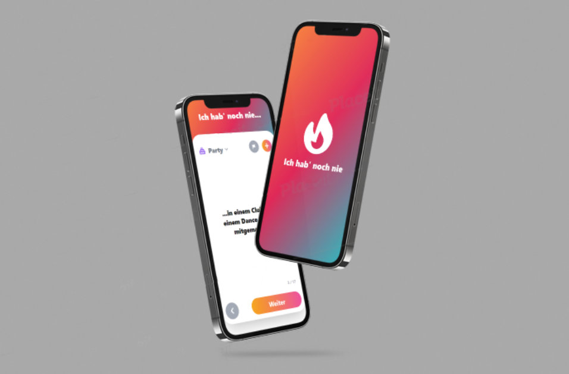

# *"Never have I ever"* web app

Simple progressive web app (PWA) for the little party game called *"never have i ever"* (german: *"Ich hab' noch nie"*).

It is available at [https://neverhaveiever.web.app](https://neverhaveiever.web.app).

> **Note:** This app is currently only in german.

## Features:
- cycle through shuffled, predefined "never have I ever" questions
- choose questions from various categories or cycle through all of them
- add questions on your own for everyone to see
- report questions to filter them out for you and for others
- edit existing questions
- install this app as a PWA
- dark mode

## Tech stack:
#### Frontend:
- [Vue.js 3](https://v3.vuejs.org/) with usage of the Composition API
- [Vite](https://vitejs.dev/) as the frontend tooling + bundler
- [TypeScript](https://www.typescriptlang.org/) as primarily used language
- [TailwindCSS](https://tailwindcss.com/) for css utility classes
- [Sass](https://sass-lang.com/) for advanced css usage (*scss*)
- [firebase-orm](https://github.com/yarivluts/firebase-orm) for object-relational typescript mapping of the used firestore database
  
#### Backend:
- [Googles Cloud Firestore](https://firebase.google.com/docs/firestore?hl=en) as the database
- [Firebase deploy](https://firebase.google.com/) as the hosting
  
#### Other:
- [pwa-asset-generator](https://github.com/onderceylan/pwa-asset-generator) for automatic generation of favicon and PWA assets (splash screens and manifest icons)
